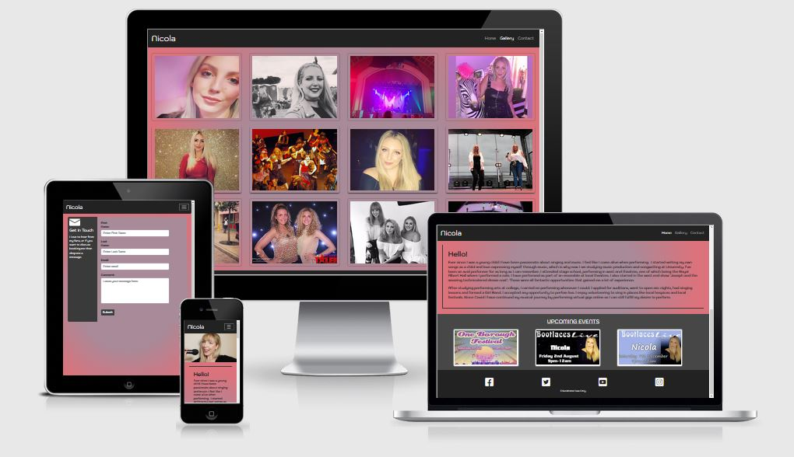
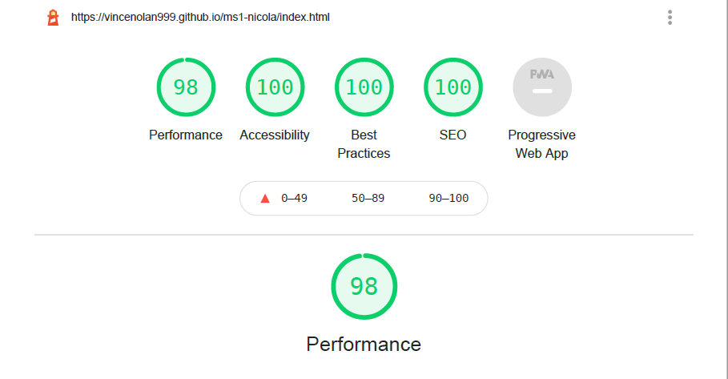
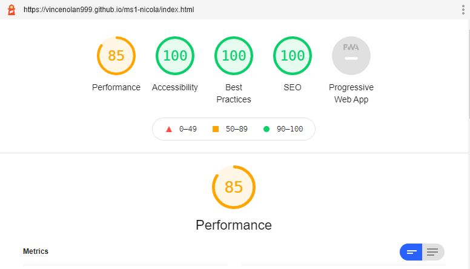

# Nicola - A Singers Website

## <u>Screenshots</u>

### [Link to Live Github hosted website](https://vincenolan999.github.io/ms1-nicola/)

## A User-Centric Frontend Milestone Project

- This is my first Milestone project with Code Institute and my first ever web design.
I decided to create a website for a family member who is a singer along the lines of a suggested project withing the course (Build a website for a band).
The aim of the project is give my niece web presence for potential employers and show-case her abilities to fans and potential employers.

---
## <u>Table of Contents</u>

- [UX](#ux)
    - [Website owner business goals](#website-owner-business-goals)
    - [User goals](#user-goals)
    - [User stories](#user-stories)
    - [Structure of the website](#structure-of-the-website)
    - [Wireframes](#wireframes)
- [Features](#features)
- [Technology Used](#technology-used)
- [Testing](#testing)
    - [Functionality testing](#functionality-testing)
    - [Compatibility testing](#compatibility-testing)
    - [Code Validation](#code-validation)
    - [User stories testing](#user-stories-testing)
    - [Issues found during site development](#issues-found-during-site-development)
    - [Performance testing](#performance-testing)
- [Deployment](#deployment)
- [Credits](#credits)
- [Screenshots](#screenshots)
 
 ---
## <u>UX</u>

 ### User Goals
  
 #### New user Goals

- Be able to find out more about Nicola.

- Be able to see pictures of Nicola.

- Be able to contact Nicola.

- Fans, Employers, or artists to be able to contact Nicola to hire or collaborate.

- Be able to see where Nicola is next performing.

#### Returning User Goals

- I want to keep up-to date on where Nicola is performing.

### User Stories

#### As A New user.

- I want to find out how Nicola became a singer.

- I want know where and when Nicola is next performing
 
- I want to be able to contact Nicola as I want to hire her to sing at my event.

- I want to contact Nicola as I am an artist and would like to collaborate with Nicola

#### As A returning user.

-  I want to see pictures of Nicola.

-  I want to keep up-to date where Nicola is next performing.

#### WebSite Owner story

- I want to have a Web presence so prospective fans/employers/artists can find out more about me.

- Be able to update and inform my fans of my singing and songwriting and any new videos or music I am producing.

- A way for fans/employers/artists to contact me e.g hiring me.

### Structure of the website

- I want the website to be easily accessible, simple to navigate and user friendly. It must also be displayed 
  for various devices (desktop ,Tablet, Mobile Phone) whilst maintaining a great user experience . Links within the website directing me to other Pages either within
  this website or to other social media accounts (youtube etc). I would like to have effects like hover to bring the website alive and encourages interaction.

### Wireframes

- I used Balsamic to create wireframe mock ups of how I envisioned the website to look.
These are listed below

-  

---
## <u>Features</u>

- As this is a new project the website will consist of 3 pages with view to increase as necessary (see features left to implement below.)
Home page, Gallery and Contact page.

#### Fonts

- The main font used is 'Kodchasan' with back-up of  sans-serif  obtained from [Google-fonts](www.fonts.google.com)

#### Images

- Most Images are sourced direct from the singers social media.  In time these can be replaced with higher quality images.  The cover picture was created by the singer.

- [unsplash](www.unsplash.com) used for images as well. see [#credits](#credits)

#### Navbar and footer

- Both have same styling and colors for consistency. This is reflected across all pages of the website.

- Navbar located at top with 'Brand' to the left and a responsive menu on the right. For Mobile and tablet this is 
  an expanding 'Hamburger' menu opening below the icon to reveal the three pages (Home, Gallery and Contact).
  On desktop the 'hamburger'  is replaced with links for the 3 pages.  

- Footer is located at the bottom and contains Social media links.

#### Hero Image

- Full size image of the singer that is responsive to device size

#### about-me section

- A brief bio of Nicola

#### Upcoming events.

- A gallery with Nicola's upcoming performances, including dates, time and location.

#### Gallery Page

- Fixed tile gallery of images relating to Nicola. Responsive effect when hovering over the pictures. 

#### Contact Page

-  Contains a form for fans, prospective employers  or other performers to send messages to Nicola.

 
### Existing Features

- Content form allows for a message to be sent to the site owner.  This could be for prospective employers to make contact to hire Nicola , other singers/bands wishing to collaborate
or Fans to ask questions.

#### Future Features 

- Fully functioning Play/stop button in the header.  

- Gallery pictures currently enlarges on hover. Plan to add a large pop-out carousel of the images when clicked on.

- a Separate Video/ music page. 

- Merchandise page 

- incorporate a press kit/review section into the website by either a new page or addition to existing.

- A News blog which links to recent performances or live stream events as well as other relevant news.

- Higher quality and relevant Images when they become available.

[Back to Table of contents](#table-of-contents)

---
## <u>Technology Used</u>

* [HTML5](https://en.wikipedia.org/wiki/HTML5)
  - Main Programming language

* [CSS](https://en.wikipedia.org/wiki/CSS) 

  - Style sheet language

* [Google Fonts:](https://fonts.google.com/)

  - Used to import custom fonts

* [Font Awesome:](https://www.fontawesome.com) 

  - Used to import icons

* [GitHub:](https://www.github.com.com)

  - Used to store projects created in gitpod. 

* [Gitpod:](https://www.gitpod.io.com)

   - used to develop the project, including version control (using commits and comments.)

* [Bootstrap 4:](https://www.getbootstrap.com)

  - used to assist in a responsive site with a mobile first approach. 

* [Balsamic:](https://www.balsamiq.com)

   - Used to create wireframe of the project.

* [windows Photo editor](https://www.microsoft.com/en-us/p/photo-editor-for-windows-10/9mzwk7vt6b3g?activetab=pivot:overviewtab)

   - Basic photo editor

[Back to Table of contents](#table-of-contents)

---
## <u>Testing</u>

 - Navbar
    - Clicking on the links from each page takes you to the correct location. 
    In addition the correct link is highlighted as the active page.
    - On gallery and Navbar clicking 'Nicola' brand takes to main page.
    - drop down menu works correctly on each page.

- Footer 
    - Clicking Facebook takes you to Facebook.com in a new tab
    - Clicking Facebook takes you to twitter.com in a new tab
    - Clicking Facebook takes you to youtube.com in a new tab
    - Clicking Facebook takes you to instagram.com in a new tab
        - Checked for all pages.

- Upcoming Events.

   - Hovering over images transitions them larger with no visible issues.

- Gallery
    - All images have transition effect on hover with no obvious issues. Number of columns changes 
    depending on virtual device used.

- Contact Page.
    - testing revealed missing 'required' and also contact form not acting as expected. Bootsnipp template contact form
    did not start with the 'form' heading and was not displaying the 'please fill in this field' for the input boxes as a result. 
    This has been fixed.

    - test: left first name blank.  pressed submit, box red outline  around all boxes and 'please fill in field'.
    - test: left first name entered.   pressed submit, red outline in empty boxes and 'please fill in field' shown in last name.
    - test: invalid email entered. Requested valid email and red outline.
    - test: valid email entered and works as expected.
    - test: all inputs completed except comment box.  red outline on comments and 'please fill in field' shown.
    - test: all fields completed correctly.  Upon submit the entry's act as thou they are sent and form resets.

### Functionality testing

- Mozilla Browser used to run Gitpod and developer tools used to test , solve problems, style and responsiveness.
Chrome developer tools used to check compatibility during project and to check on consistency of Mozilla dev tools.

### Compatibility testing

- I have tested the website on the virtual devices contained with the Dev Tools of Mozilla and Chrome with no 
issues seen on either. A wide range of screen sizes tested from mobile, tablet and desktop.

- I have tested compatibility on the github pages published website of the project on a 1920 x 1080 monitor, a galaxy s7 
and a Motorola  one+ mobile phone with no issues noted.

### Code Validation
-  https://jigsaw.w3.org/css-validator/   
    - passed with no errors found. This document validates as CSS level 3 + null !
-  https://validator.w3.org/
    - all pages checked with no issues. 
-  https://wave.webaim.org/ - A web accessibility checker
    - no errors or contrast errors detected. 
    - contrast passed . Contrast Ratio of 5.08 on about me page and 5.12 on contact page.

### User stories testing

- I want to find out how Nicola became a singer.
    - On main navigation page the about me section is present.

- I want know where and when Nicola is next performing
    - On the main page scrolling to the bottom presents the events section.

- I want to see pictures of Nicola.
    - From the navigation bar I can select the Gallery link which then displays images of Nicola
 
- I want to be able to contact Nicola as I want to hire her to sing at my event.
    - On the navigation bar there is a link for Contact. Selecting this takes me to a contact form where I can
    input my details and leave a message.

- I want to contact Nicola as I am an artist and would like to collaborate with Nicola.
    - There is a contact page where I can leave my details and message for Nicola.

### Issues found during development

- Fixed Navbar caused content go underneath. After trying margins and padding's on the divs and sections to solve this to 
no avail I found that using padding-top on the body tag pushed content lower and solved the issue. This led to other issues where 
I then made the navbar a fixed height which caused no background to be displayed on the drop down menu. This was fixed 
by changing to min-height for navbar and therefore making sizing of the navbar predictable and easier.

- Initially had a carousel to display the event section, this caused some issues where the page seems to be flicking when the image changed.
This feature didn't look particularly good so was removed with advice from the mentor.  

- gallery images - adding container- fluid solved issue with borders on left and right. 

- gallery image display. column sizes changed for better layout. xl-3 added for full screen viewing. md-3 changed to 4 which is better for i-pad pro. scaling of images better.
They were becoming squashed as too many items being displayed.  I have set media queries for different view sizes to keep them at the intended sizes.

- The contact page had a minor display issue when viewing on small mobile devices. When the contents were moved into block form
the background was showing where it should be the contents box.  Issue resolved by adding 5px to the padding-right.

- The contact page display was having issues with tablet displays. White space present at the bottom due to height of display. Scaled well on mobile/desktop. 
setting vh-100 solved this however then caused issue with the block element overlapping low height display. 
Finally settled on including a min-height of 790px which fixed the height issues.

- The Navbar had a particularly annoying issue that was limited to I pad devices where 1px Grey horizontal lines were visible in the footer section of all pages
and also in-between the event heading and event images.  This was solved for me by moving the ' h4 - Upcoming events' onto the top of the box container for 
the events section.  Prior to this it was nested above in its own Div that closed at start of the event images. This coincidentally stopped
all the Grey lines including them in the footer.

### Performance testing

  - I have used [Lighthouse](https://developers.google.com/web/tools/lighthouse/) for the performance testing.
The first attempt showed a few performance drops on mobile devices. These included no meta values for the social media links, a h4 header being used, no meta description and older image format used.

- These were addressed and the results as follows.

#### Desktop performance

#### Mobile Performance

- PDF of results contained within assets/docs.

[Back to Table of contents](#table-of-contents)

---
## <u>Deployment</u>
My project was developed on Gitpod with regular commits during development to Github via pushing. This also ensured against data loss.

To deploy my project in github I took the following steps.

- Login and Select the repository in github. ([ms1-nicola](https://github.com/VinceNolan999/ms1-nicola))
- Click on the settings button
- locate the Github pages section.
- select 'save' and then refresh or an auto refresh
- Displayed at top of Github pages - Your site is published at https://vincenolan999.github.io/ms1-nicola/

To Deploy locally.
- Login and Select the repository in github. [ms1-nicola](https://github.com/VinceNolan999/ms1-nicola)
- go-to 'code' and  'download zip'
- locate the ZIP file, unpack and deploy into your local environment.

Alternatively you can [Clone](https://docs.github.com/en/free-pro-team@latest/github/creating-cloning-and-archiving-repositories/cloning-a-repository)
or [Fork](https://docs.github.com/en/free-pro-team@latest/github/getting-started-with-github/fork-a-repo)
this repository ([ms1-nicola](https://github.com/VinceNolan999/ms1-nicola)) into your github account.

[Back to Table of contents](#table-of-contents)

---
## <u>Credits</u>

### knowledge base and design ideas

* [getbootstrap.com/docs](https://getbootstrap.com)

* [w3schools.com](https://www.w3schools.com)

* [geeksforgeeks](https://www.geeksforgeeks.org/how-to-change-hamburger-toggler-color-in-bootstrap/) -
changing 'Hamburger' Menu color 

### Code Templates

- Navbar - [Bootstrap](https://getbootstrap.com/docs/4.6/components/navbar/)   
- gallery grid and Event grid - [Startbootstrap](https://startbootstrap.com/snippets/thumbnail-gallery)  
- Contact form -[Bootsnip](https://bootsnipp.com/snippets/qr1zR) 

### Content

- Bio/about me. Created by Nicola and edited by myself.  

### Media

- Images provided by Nicola

- Clickplay photos. Dagenhams got talent. Nicola and Rebecca

- [Unsplash](https://www.unsplash.com) - photo 12 in gallery - Photo by Robert Vergeson on Unsplash

### Acknowledgments

- Code Institute README and template from mentor Adee Adeye utilized to meet expected criteria.  

- Code Institute Pre-loaded github tools

- [Kevin Powell](https://www.youtube.com/channel/UCJZv4d5rbIKd4QHMPkcABCw) - Youtube hosted Front end tutorials.

- Credit: https://www.geeksforgeeks.org on how to change hamburger menu color

- I was inspired by the website of [Erin Wall](http://www.erinwall.com/) which really drew my attention to its structure and layout
 
[Back to Table of contents](#table-of-contents)